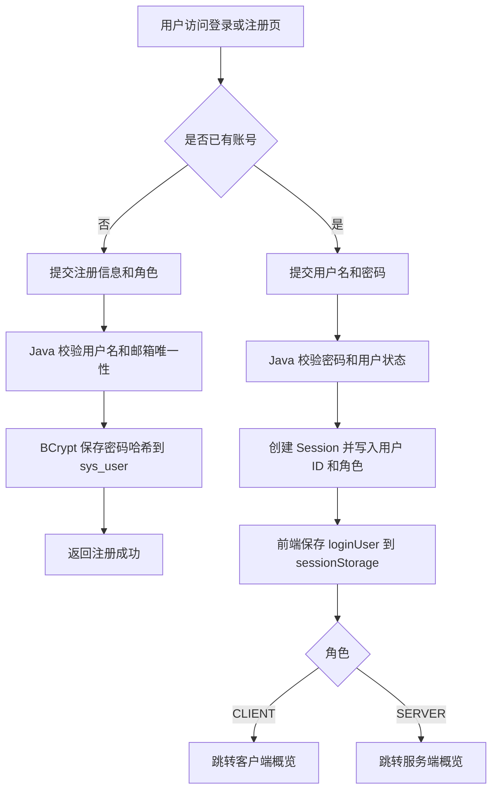
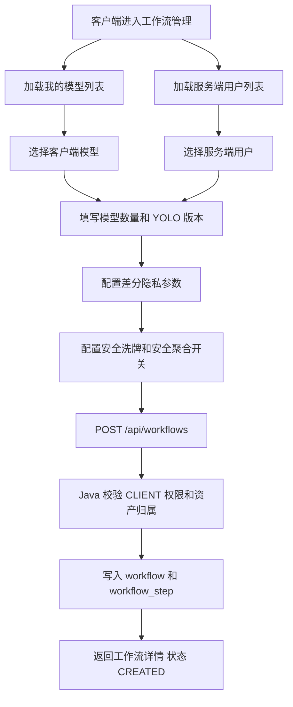
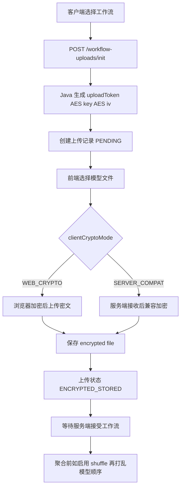
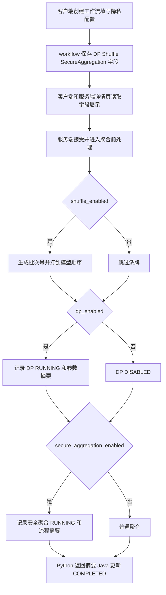
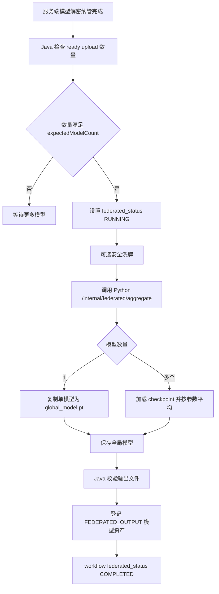
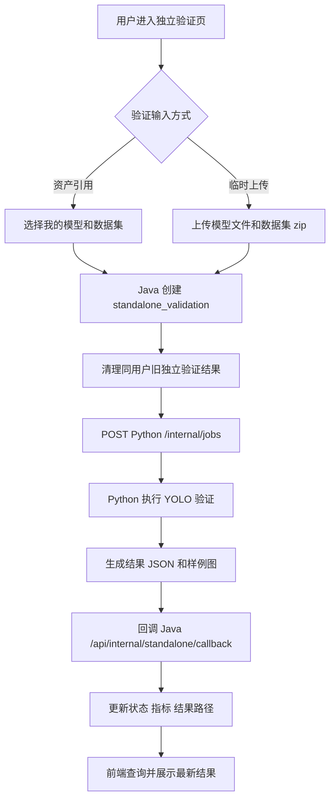

# 项目交接总览文档：基于联邦学习的农业保险信息安全防御与隐私保护原型系统

> 生成日期：2026-07-09  
> 扫描范围：`frontend-web`、`service-java`、`service-python`、`docs/sql`、`docker-compose.yml`、`nginx.conf`、`.env`、`.env.local-server`、根目录 README 与脚本。  
> 重要原则：本文以当前仓库代码为准；无法从代码确认的内容统一标注“需人工确认”。

## 目录

- [一、项目背景与核心定位](#一项目背景与核心定位)
- [二、项目目录结构](#二项目目录结构)
- [三、整体技术架构](#三整体技术架构)
- [四、系统角色与权限](#四系统角色与权限)
- [五、功能模块梳理](#五功能模块梳理)
- [六、前端页面和路由](#六前端页面和路由)
- [七、Java 后端接口清单](#七java-后端接口清单)
- [八、Python 服务接口清单](#八python-服务接口清单)
- [九、数据库结构](#九数据库结构)
- [十、核心业务流程图](#十核心业务流程图)
- [十一、运行与部署方式](#十一运行与部署方式)
- [十二、常见问题与排查方法](#十二常见问题与排查方法)
- [十三、当前项目状态和后续开发建议](#十三当前项目状态和后续开发建议)
- [十四、明显不一致、风险与待确认项](#十四明显不一致风险与待确认项)

## 一、项目背景与核心定位

当前项目正式名称为：

**基于联邦学习的农业保险信息安全防御与隐私保护原型系统**

系统定位是一个面向农业保险场景的联邦学习与隐私保护原型系统。当前代码已经实现了客户端与服务端双角色的业务闭环，包含用户注册登录、模型资产管理、数据集资产管理、客户端创建工作流、服务端接收工作流、客户端模型加密上传、服务端解密纳管、差分隐私参数展示、安全洗牌状态展示、安全聚合状态展示、FEDML/FedAvg 风格联邦聚合、独立验证、工作流验证、验证结果展示、结果保存和删除治理等能力。

需要特别说明：

- 当前系统不是纯概念 Demo，已经有真实的前端页面、Java API、MySQL 表结构、Python FastAPI 任务服务和 Docker Compose 部署链路。
- 当前“联邦学习”对外字段和页面文案使用 `FEDML`，但 Python 侧真实实现是 `aggregate_fedavg`：对多个模型 checkpoint 做 FedAvg 风格参数平均；单模型场景直接复制为全局模型。
- 当前差分隐私、安全洗牌、安全聚合主要是原型链路与状态展示：
  - 差分隐私字段会随工作流创建、聚合流程和 Python 响应被记录与展示，但 Python 聚合代码未实际加噪。
  - 安全洗牌会在 Java 聚合前用 `SecureRandom` 打乱参与模型顺序，并记录批次号和顺序摘要。
  - 安全聚合会记录 `prepare -> execute -> finalize` 形式的流程摘要，但不是完整密码学安全聚合协议。
- 验证任务由 Java 创建业务记录，再调用 Python；Python 使用 Ultralytics YOLO/OpenCV/Pillow 等库执行模型验证、生成指标 JSON 和识别样例图片，再回调 Java。

## 二、项目目录结构

### 2.1 总体目录树

以下目录树省略了 `node_modules`、`target`、缓存文件等大体积构建产物，只保留交接时需要关注的结构。

```text
workflow-platform/
├─ frontend-web/                         # Vue 3 + TypeScript 前端
│  ├─ src/
│  │  ├─ api/                            # axios API 封装
│  │  ├─ components/                     # 公共布局、仪表盘、验证结果组件
│  │  ├─ constants/                      # 系统名称、角色、工作流状态文案
│  │  ├─ router/                         # Vue Router 路由与角色守卫
│  │  ├─ stores/                         # Pinia/sessionStorage 用户态
│  │  └─ views/                          # 登录、注册、客户端、服务端页面
│  ├─ Dockerfile                         # 前端构建并由 Nginx 提供静态资源
│  ├─ package.json                       # 前端依赖和脚本
│  └─ vite.config.ts                     # Vite 配置
├─ service-java/                         # Spring Boot Java 后端
│  ├─ src/main/java/com/workflow/
│  │  ├─ config/                         # 安全、存储、集成、CORS/Session 配置
│  │  ├─ controller/                     # REST Controller
│  │  ├─ dto/                            # 请求/响应 DTO
│  │  ├─ entity/                         # MyBatis Plus 实体
│  │  ├─ mapper/                         # Mapper
│  │  ├─ service/                        # Service 接口与实现
│  │  ├─ support/                        # 状态文案、错误摘要、工具支持
│  │  └─ vo/                             # 前端视图对象
│  ├─ src/main/resources/application.yml # Java 运行配置
│  ├─ src/test/                          # Java 测试
│  ├─ sql/                               # Java 后端相关补丁 SQL
│  ├─ Dockerfile                         # Java 服务镜像
│  └─ pom.xml                            # Maven 依赖
├─ service-python/                       # FastAPI Python 任务服务
│  ├─ app/
│  │  ├─ api/                            # health/jobs/federated 路由
│  │  ├─ core/                           # 配置、日志
│  │  ├─ models/                         # Pydantic 请求模型
│  │  ├─ services/                       # 验证、聚合、回调、结果文件服务
│  │  └─ storage/                        # Python 本地开发存储，容器内会映射到共享存储
│  ├─ Dockerfile
│  └─ requirements.txt
├─ docs/
│  ├─ sql/                               # 初始化 SQL 与迁移 SQL
│  ├─ reports/                           # 审计/说明类文档
│  └─ PROJECT_HANDOVER_OVERVIEW.md       # 本交接文档
├─ scripts/
│  ├─ cleanup-result-artifacts.ps1       # Windows 结果产物清理脚本，默认 dry-run
│  ├─ cleanup-result-artifacts.sh        # Linux/macOS 结果产物清理脚本，默认 dry-run
│  ├─ init-db.sh                         # 手动初始化数据库
│  ├─ preflight-check.sh                 # 云部署预检
│  ├─ smoke-test.sh                      # 云部署冒烟测试
│  └─ mock_python_callback.py            # Python 回调模拟脚本
├─ docker/mysql/init/                    # MySQL 容器首次启动初始化脚本
├─ .runtime/local-server/                # 本机服务器模式运行时数据、日志、MySQL 数据
├─ storage/                              # 本地开发模式存储目录
├─ docker-compose.yml                    # gateway/service-java/service-python/mysql 编排
├─ nginx.conf                            # gateway Nginx 配置模板
├─ .env                                  # 默认/云部署环境变量，默认可能使用 80/3306
├─ .env.local-server                     # 本机临时服务器环境变量，使用 18080/13306
├─ .env.example                          # 云部署环境变量模板
├─ .env.local-server.example             # 本机服务器模式模板
├─ README_LOCAL_SERVER.md                # 本机局域网演示说明
├─ README_DEPLOY.md                      # 单机云部署说明
├─ README_DEPLOY_CHECKLIST.md            # 部署检查清单
├─ start-local-server.ps1/.bat           # Windows 本机服务器启动脚本
├─ stop-local-server.ps1/.bat            # Windows 本机服务器停止脚本
├─ check-local-server.ps1/.bat           # Windows 本机服务器健康检查脚本
└─ deploy.sh                             # Linux 云部署快捷脚本
```

### 2.2 主要目录作用

| 路径 | 类型 | 作用 | 运行是否必须 |
|---|---|---|---|
| `frontend-web` | 前端应用 | 提供登录、注册、客户端/服务端工作台、模型/数据集/工作流/验证页面 | 是，gateway 镜像构建需要 |
| `service-java` | Java 后端 | 业务 API、鉴权、资产管理、工作流编排、数据库访问、调用 Python、接收回调 | 是 |
| `service-python` | Python 服务 | 异步验证任务、YOLO 推理/验证、联邦聚合、结果文件和样例图生成 | 是 |
| `docs/sql` | 数据库脚本 | MySQL 初始化表结构和后续迁移 SQL | 首次部署必须 |
| `docker/mysql/init` | MySQL 初始化 | MySQL 空数据卷首次启动时导入 `docs/sql/000_init_workflow_platform_schema.sql` | 首次部署必须 |
| `scripts` | 运维辅助 | 预检、冒烟、初始化 DB、清理结果产物、模拟回调 | 辅助 |
| `.runtime/local-server` | 本机模式运行数据 | 本地 Docker 模式下挂载 storage/logs/mysql-data | 本机模式运行后产生 |
| `storage` | 本地开发存储 | 非 local-server 的开发存储根目录，包含模型、结果、缓存等 | 按运行模式使用 |

### 2.3 重要配置文件

| 文件 | 作用 | 注意事项 |
|---|---|---|
| `docker-compose.yml` | 定义 `gateway`、`service-java`、`service-python`、`mysql` 四个服务、网络、健康检查、共享 volume | 本地启动必须配合 `.env.local-server` |
| `nginx.conf` | gateway Nginx 配置；前端 SPA fallback；`/api/` 代理到 Java；`/healthz` 返回 `ok` | `${JAVA_UPSTREAM_URL}` 由 compose 注入 |
| `.env.local-server` | 本机临时服务器模式配置；入口 `18080`，MySQL 宿主机 `13306`，运行数据写入 `.runtime/local-server` | 本地推荐使用，避免 3306 冲突 |
| `.env` | 默认/云部署配置；常见端口为 `80` 和 `3306`；包含占位密码和回调密钥 | 本地不要直接 `docker compose up -d --build` |
| `service-java/src/main/resources/application.yml` | Java 服务配置，读取 env；包含 session、datasource、Python 集成、存储根路径、CORS、用户过滤规则 | 修改 env 后需重启容器 |
| `service-python/app/core/config.py` | Python 服务配置，读取 env；包含存储、结果目录、样例图目录、日志、YOLO 阈值 | Python 容器启动时生效 |
| `frontend-web/vite.config.ts` | Vite 配置 | Docker 构建时前端 API 走 `/api` |

### 2.4 必须文件、文档与辅助工具

- 运行项目必须：
  - `docker-compose.yml`
  - `.env.local-server` 或 `.env`
  - `nginx.conf`
  - `frontend-web/Dockerfile`
  - `service-java/Dockerfile`
  - `service-python/Dockerfile`
  - `docs/sql/000_init_workflow_platform_schema.sql`
  - `docker/mysql/init/000_init_workflow_platform_schema.sh`
- 文档：
  - `README_LOCAL_SERVER.md`
  - `README_DEPLOY.md`
  - `README_DEPLOY_CHECKLIST.md`
  - `docs/reports/*`
  - `docs/PROJECT_HANDOVER_OVERVIEW.md`
- 脚本/辅助：
  - `start-local-server.*`
  - `stop-local-server.*`
  - `check-local-server.*`
  - `deploy.sh`
  - `scripts/preflight-check.sh`
  - `scripts/smoke-test.sh`
  - `scripts/init-db.sh`
  - `scripts/cleanup-result-artifacts.*`

## 三、整体技术架构

### 3.1 架构总览

```text
Browser
  |
  | http://127.0.0.1:18080 或 http://局域网IP:18080
  v
gateway / Nginx
  |-- 静态资源：frontend-web 构建产物
  |-- /api/* 反向代理
  v
service-java / Spring Boot
  |-- MyBatis Plus -> MySQL
  |-- 共享 storage/logs volume
  |-- HTTP 调用
  v
service-python / FastAPI
  |-- YOLO 验证
  |-- FedAvg 风格聚合
  |-- 结果 JSON / 样例图写入共享 storage
  |-- HTTP callback
  v
service-java / internal callback API
```

### 3.2 前端

当前前端位于 `frontend-web`：

- Vue：`vue ^3.5.31`
- TypeScript：`~6.0.0`
- Vite：`^8.0.3`
- Element Plus：`^2.13.6`
- Pinia：`^3.0.4`
- Vue Router：`^5.0.4`
- Axios：用于访问 Java `/api`

主要代码入口：

- 路由：`frontend-web/src/router/index.ts`
- API：`frontend-web/src/api/*.ts`
- 布局：`frontend-web/src/components/AppLayout.vue`
- 首页概览：`frontend-web/src/components/dashboard/OverviewDashboard.vue`
- 客户端页面：`frontend-web/src/views/client/*`
- 服务端页面：`frontend-web/src/views/server/*`
- 公共验证工作台：`frontend-web/src/components/validation/*`

前端路由按角色拆分为：

- 公共页：`/login`、`/register`
- 客户端：`/client/dashboard`、`/client/workflows`、`/client/progress`、`/client/models`、`/client/datasets`、`/client/validation`
- 服务端：`/server/dashboard`、`/server/workflows`、`/server/progress`、`/server/models`、`/server/datasets`、`/server/validation`

前端登录态当前由后端 Session Cookie + 前端 `sessionStorage` 中的 `loginUser` 共同维护。路由守卫主要依赖 `sessionStorage` 判断是否登录和角色，不会在每次路由切换时调用后端 `me` 接口。当前代码未发现后端 `/auth/logout` 或 `/auth/me` 接口。

### 3.3 Java 后端

当前 Java 后端位于 `service-java`：

- Java：`21`
- Spring Boot：`3.5.0`
- Spring Security：Session 登录、`@PreAuthorize` 权限控制
- MyBatis Plus：`3.5.15`
- MySQL：容器镜像 `mysql:8.4`
- Maven：`pom.xml`

核心分层：

- `controller`：REST API
- `service`/`service.impl`：业务流程、权限判断、调用 Python、结果治理
- `mapper`：MyBatis Plus Mapper
- `entity`：数据库实体
- `dto`：请求 DTO，包括 Python 集成 DTO
- `vo`：返回给前端的视图对象
- `config`：安全、存储、Python 集成、CORS、Session
- `support`：工作流步骤文案、错误摘要、状态规范化

安全机制：

- `/api/auth/login`、`/api/auth/register`、`/api/health/**`、`/api/internal/**` 放行。
- 其他 `/api/**` 需要登录 Session。
- `SessionAuthenticationFilter` 从 session 读取 `LOGIN_USER_ID`、`LOGIN_USERNAME`、`LOGIN_ROLE_CODE` 并写入 Spring Security 上下文。
- 角色权限使用 `CLIENT`、`SERVER` 作为 authority，Controller 上有 `@PreAuthorize("hasAuthority('SERVER')")` 等约束。
- 部分接口没有显式注解，但 Service 内部使用 `AuthContext` 判断当前用户和角色。

### 3.4 Python 服务

当前 Python 服务位于 `service-python`：

- Python：`3.11`
- FastAPI：`0.110.0`
- Uvicorn：`0.27.1`
- PyTorch：`2.6.0`
- Ultralytics YOLO：`8.3.0`
- OpenCV：`opencv-python-headless`
- Pillow、NumPy、PyYAML、requests

主要代码入口：

- FastAPI app：`service-python/app/main.py`
- 任务 API：`service-python/app/api/jobs.py`
- 联邦聚合 API：`service-python/app/api/federated.py`
- 健康检查：`service-python/app/api/health.py`
- 验证执行：`service-python/app/services/task_runner.py`
- YOLO 验证：`service-python/app/services/yolo_validation_service.py`
- 联邦聚合：`service-python/app/services/federated_aggregation_service.py`
- 回调 Java：`service-python/app/services/callback_service.py`
- 结果文件：`service-python/app/services/result_service.py`
- 任务存储：`service-python/app/services/job_service.py`

### 3.5 网关与部署

Docker Compose 服务关系：

| 服务 | 作用 | 端口/网络 |
|---|---|---|
| `gateway` | Nginx，提供前端静态页面，代理 `/api/*` 到 Java | 本地 `.env.local-server` 映射 `0.0.0.0:18080 -> 80` |
| `service-java` | Spring Boot API | 容器内 `8080`，gateway 通过 Docker 网络访问 |
| `service-python` | FastAPI 任务服务 | 容器内 `8000`，Java 通过 `http://service-python:8000` 访问 |
| `mysql` | MySQL 8.4 | 本地 `.env.local-server` 映射 `127.0.0.1:13306 -> 3306` |

本地推荐访问：

- 本机：`http://127.0.0.1:18080`
- 局域网：`http://本机局域网IP:18080`

强制注意：

- 本地演示/开发应使用 `.env.local-server`。
- 不要直接执行 `docker compose up -d --build`，否则默认读取 `.env`，可能使用宿主机 `3306` 导致 MySQL 端口冲突。

## 四、系统角色与权限

### 4.1 客户端用户

角色代码：`CLIENT`

可访问页面：

- `/client/dashboard`
- `/client/workflows`
- `/client/progress`
- `/client/models`
- `/client/datasets`
- `/client/validation`

主要操作：

- 注册/登录为客户端。
- 登记、上传、修改、删除自己的模型资产。
- 登记、上传、修改、删除自己的数据集资产。
- 选择自己的模型、服务端用户、隐私参数，创建工作流。
- 初始化模型上传，选择模型文件，通过 AES 加密上传。
- 查看上传进度、洗牌/差分隐私/安全聚合状态。
- 查看工作流验证结果，保存或删除结果。
- 发起独立验证，包括资产引用验证和临时上传验证。

工作流职责：

- 作为工作流发起方。
- 提供模型数量、模型资产、隐私参数配置。
- 上传参与联邦学习的模型文件。
- 查看验证结果和工作流进度。

权限判断：

- 前端路由 `meta.role = CLIENT`。
- 后端通过 Session 中 `LOGIN_ROLE_CODE=CLIENT` 和 `@PreAuthorize("hasAuthority('CLIENT')")` 或 Service 内 `AuthContext` 判断。
- 客户端只能操作自己拥有的资产和自己发起的工作流；部分工作流详情在 `sharedWithClient` 情况下可读。

### 4.2 服务端用户

角色代码：`SERVER`

可访问页面：

- `/server/dashboard`
- `/server/workflows`
- `/server/progress`
- `/server/models`
- `/server/datasets`
- `/server/validation`

主要操作：

- 注册/登录为服务端。
- 登记、上传、服务端路径导入、修改、删除自己的模型资产。
- 登记、上传、服务端路径导入、修改、删除自己的数据集资产。
- 查看分配给自己的工作流。
- 为工作流绑定服务端数据集。
- 接受工作流，触发服务端解密和模型纳管。
- 触发联邦聚合。
- 对工作流聚合结果发起验证。
- 发起服务端独立验证。
- 保存或删除工作流验证结果。

工作流职责：

- 作为工作流接收方和验证执行方。
- 接收客户端加密模型，解密到服务端受控存储。
- 将解密模型登记为服务端模型资产。
- 在模型数量满足要求后触发 FEDML/FedAvg 风格聚合。
- 绑定数据集并调用 Python 验证全局模型。

权限判断：

- 前端路由 `meta.role = SERVER`。
- 后端通过 Session authority `SERVER`、`@PreAuthorize("hasAuthority('SERVER')")` 和 Service 内工作流 `serverUserId` 判断。
- 服务端路径导入接口仅服务端可用。

## 五、功能模块梳理

### 5.1 用户注册登录

| 项目 | 说明 |
|---|---|
| 前端页面 | `LoginView.vue`、`RegisterView.vue` |
| 前端 API | `POST /auth/register`、`POST /auth/login` |
| Java Controller | `AuthController` |
| Java Service | `AuthServiceImpl` |
| 数据表 | `sys_user` |
| 关键字段 | `username`、`password_hash`、`display_name`、`email`、`role_code`、`status`、`is_deleted` |

主要流程：

1. 注册时前端提交用户名、密码、邮箱、角色。
2. Java 检查用户名/邮箱唯一性，使用 BCrypt 写入密码哈希。
3. 登录时 Java 校验用户名、密码、状态。
4. 登录成功后后端创建 Session，写入 `LOGIN_USER_ID`、`LOGIN_USERNAME`、`LOGIN_ROLE_CODE`。
5. 前端把返回用户信息写入 `sessionStorage`，后续路由守卫依赖本地用户信息和角色跳转。

注意事项：

- 当前未发现后端 `/auth/logout` 和 `/auth/me` 接口；前端退出登录主要是清理 `sessionStorage` 并跳转 `/login`。
- Session Cookie 名称在 `application.yml` 中为 `WORKFLOWSESSION`。
- 若前端页面和 API 非同源访问，容易出现 Cookie/Session 问题；推荐统一 gateway 入口。

### 5.2 首页 / 概览页

| 项目 | 说明 |
|---|---|
| 前端页面 | `ClientDashboardView.vue`、`ServerDashboardView.vue`，公共组件 `OverviewDashboard.vue` |
| 前端 API | `GET /dashboard/overview` |
| Java Controller | `DashboardController` |
| Java Service | `DashboardServiceImpl` |
| 数据表 | `workflow`、`standalone_validation`、`model_asset`、`dataset_asset`、`workflow_model_upload` |

主要展示：

- 工作流总数、进行中/完成/失败数量。
- 模型数、数据集数。
- 最新工作流。
- 最近验证结果。
- 最新准确率、来源类型、来源标签。
- 当前可操作事项，如绑定数据集、上传模型、启动验证等。

当前最新结果修复情况：

- 前端 `getDashboardOverview()` 请求附带 `_t=Date.now()`，并设置 `Cache-Control: no-cache`、`Pragma: no-cache`。
- 后端 `DashboardController` 响应也设置 no-cache header。
- `DashboardServiceImpl` 会从已完成工作流和已完成独立验证中选择最近有效结果，并忽略 `workflow.result_retention_status = DELETED` 的结果。
- 因此“概览页展示旧准确率”的缓存层问题已有代码级修复；但若数据库仍有异常旧记录或 Python 结果文件未清理，仍需排查。

注意事项：

- `DashboardServiceImpl.canStartValidation` 与 `WorkflowServiceImpl.startPythonJob` 的条件略有差异：真正启动验证会额外要求联邦聚合模型已就绪。

### 5.3 模型管理

| 项目 | 说明 |
|---|---|
| 前端页面 | `ClientModelView.vue`、`ServerModelView.vue`、公共 `ModelManagePanel.vue` |
| 前端 API | `/models`、`/models/upload`、`/models/server-import`、`/models/{id}`、`/models/{id}/check` |
| Java Controller | `ModelAssetController` |
| Java Service | `ModelAssetServiceImpl` |
| 数据表 | `model_asset` |

主要能力：

- 模型登记：记录本地路径或服务端路径。
- 模型上传：浏览器上传文件，后端保存为正式资产。
- 服务端导入：服务端用户从允许的服务端路径复制模型到正式资产目录。
- 模型列表/详情/修改/删除。
- 模型路径校验。
- 工作流解密后自动登记为服务端模型资产。
- 联邦聚合后自动登记为服务端全局模型资产。

本地路径与服务端路径区别：

- 客户端路径登记：
  - `record_mode=PATH_REGISTRY`
  - `source_type=CLIENT_PATH_REGISTRY`
  - 主要用于记录和快速创建，不等于服务端可读取的真实文件。
  - 当前后端对工作流本地绑定已拒绝，真正参与工作流仍需要上传文件。
- 服务端路径登记/导入：
  - 需要位于 `WORKFLOW_SERVER_PATH_IMPORT_ROOTS` 允许根目录下。
  - 服务端路径登记可直接验证真实文件。
  - 服务端导入会复制到受控模型目录并成为正式资产。

注意事项：

- 支持的模型扩展名来自 `AssetStorageService`，包括 `.pt`、`.pth`、`.weights`、`.onnx`、`.bin`。
- 删除模型时，如果被工作流 `client_model_asset_id` 引用，会被后端拒绝。
- 前端存在 `bind-local` 相关 API，但 Java `WorkflowModelUploadServiceImpl.bindLocalModelAsset` 当前明确抛出 `REAL_FILE_UPLOAD_REQUIRED`，不要把它当作可用上传路径。

### 5.4 数据集管理

| 项目 | 说明 |
|---|---|
| 前端页面 | `ClientDatasetView.vue`、`ServerDatasetView.vue`、公共 `DatasetManagePanel.vue` |
| 前端 API | `/datasets`、`/datasets/upload`、`/datasets/server-import`、`/datasets/{id}`、`/datasets/{id}/check` |
| Java Controller | `DatasetAssetController` |
| Java Service | `DatasetAssetServiceImpl` |
| 数据表 | `dataset_asset` |

主要能力：

- 数据集登记。
- 浏览器上传 zip 数据集。
- 服务端从允许路径导入目录或 zip。
- 数据集列表/详情/修改/删除。
- 数据集路径校验、样本数和图片数统计。

注意事项：

- 客户端路径登记主要是记录，不能保证服务端 Python 能读取。
- 服务端验证工作流时，需要绑定服务端拥有、路径校验通过且图片数大于 0 的数据集。
- Python YOLO 验证会优先查找 `images/` 目录，也支持直接扫描数据集根目录。

### 5.5 工作流管理

| 项目 | 说明 |
|---|---|
| 前端页面 | `ClientWorkflowManageView.vue`、`ServerWorkflowManageView.vue` |
| 前端 API | `/workflows`、`/users/servers`、`/workflows/{id}`、`/workflows/{id}/withdraw`、`/workflows/{id}/advance` |
| Java Controller | `WorkflowController`、`UserQueryController` |
| Java Service | `WorkflowServiceImpl` |
| 数据表 | `workflow`、`workflow_step` |

客户端新建工作流：

- 选择自己的模型资产。
- 选择服务端用户。
- 填写工作流名称、期望模型数量、YOLO 版本。
- 配置差分隐私参数：`dpEnabled`、`dpEpsilon`、`dpDelta`、`dpClipNorm`、`dpNoiseMultiplier`。
- 配置安全洗牌：`shuffleEnabled`。
- 配置安全聚合：`secureAggregationEnabled`。

状态流转：

- `CREATED`：客户端创建后等待上传与服务端接收。
- `ACCEPTED`：服务端接受，自动进入解密、纳管、聚合准备。
- `PREPARING`/`TRAINING_RUNNING`/`VALIDATING`：Python 工作流验证阶段。
- `COMPLETED`：验证完成。
- `FAILED`：流程失败。
- `WITHDRAWN`：客户端撤回。

注意事项：

- 服务端接受前会检查已上传加密模型数量是否满足 `expectedModelCount` 或 `clientModelCount`。
- 服务端启动验证前要求服务端数据集已绑定、模型上传已完成、联邦聚合模型已就绪。

### 5.6 客户端模型上传与洗牌加密

| 项目 | 说明 |
|---|---|
| 前端页面 | `ClientWorkflowManageView.vue`、`ClientWorkflowProgressView.vue` |
| 前端 API | `/workflow-uploads/init`、`/workflow-uploads/{uploadId}/file`、`/workflow-uploads/progress/{workflowId}` |
| Java Controller | `WorkflowModelUploadController` |
| Java Service | `WorkflowModelUploadServiceImpl` |
| 数据表 | `workflow_model_upload`、`workflow` |

主要流程：

1. 客户端调用 `POST /workflow-uploads/init` 初始化上传。
2. Java 生成 AES key、iv、uploadToken 和过期时间，创建 `PENDING` 上传记录。
3. 前端选择模型文件。
4. 上传接口支持 `clientCryptoMode`：
   - `WEB_CRYPTO`：浏览器侧加密后上传密文。
   - `SERVER_COMPAT`：兼容模式，服务端接收明文后按记录密钥加密保存。
5. Java 将密文保存到 `model-uploads/{workflowId}/encrypted/...`。
6. 上传记录变为 `ENCRYPTED_STORED`。
7. 服务端接受工作流后再解密。

多模型上传：

- 工作流字段 `expected_model_count`/`client_model_count` 决定需要多少个模型。
- 每次上传产生一条 `workflow_model_upload` 记录。
- 联邦聚合要求完成解密纳管的上传数达到要求。

洗牌展示：

- 洗牌不是在上传时执行，而是在服务端聚合前执行。
- `shuffle_enabled=1` 时，Java 在 `WorkflowFederatedAggregationService` 中打乱参与模型顺序，生成 `shuffle_batch_no` 和 `shuffle_order_summary`。

### 5.7 服务端接受与解密处理

| 项目 | 说明 |
|---|---|
| 前端页面 | `ServerWorkflowManageView.vue`、`ServerWorkflowProgressView.vue` |
| 前端 API | `/workflows/{id}/advance`、`/workflow-uploads/{uploadId}/decrypt`、`/workflow-uploads/progress/{workflowId}` |
| Java Controller | `WorkflowController`、`WorkflowModelUploadController` |
| Java Service | `WorkflowServiceImpl`、`WorkflowModelUploadServiceImpl`、`WorkflowAcceptAutoManageAsyncService` |
| 数据表 | `workflow`、`workflow_model_upload`、`model_asset`、`workflow_step` |

主要流程：

1. 服务端查看分配给自己的工作流。
2. 调用 `POST /workflows/{id}/advance` 接受工作流。
3. Java 检查该服务端是否为指定接收方、工作流状态是否为 `CREATED`、加密模型数量是否满足要求。
4. 工作流状态更新为 `ACCEPTED`。
5. 接受后触发异步自动纳管：
   - 读取上传记录。
   - 使用 AES key/iv 解密密文模型。
   - 解密文件写入服务端受控模型目录。
   - 自动登记为服务端 `model_asset`，`source_type=WORKFLOW_DECRYPT`。
   - 上传记录变为 `COMPLETED`，写入 `server_model_asset_id`。
6. 若模型数满足要求，触发联邦聚合。

注意事项：

- 单条上传也提供 `POST /workflow-uploads/{uploadId}/decrypt`，但主流程里接受工作流后会自动处理。
- AES key/iv 目前存储在 `workflow_model_upload` 表中；这是原型系统便利实现，生产级安全需重新设计密钥管理。

### 5.8 隐私保护机制展示

| 机制 | 字段 | 页面 | 后端返回 |
|---|---|---|---|
| 差分隐私 | `dp_enabled`、`dp_epsilon`、`dp_delta`、`dp_clip_norm`、`dp_noise_multiplier`、`dp_status`、`dp_summary` | 客户端工作流创建/详情、客户端进度、服务端工作流详情、服务端进度 | `WorkflowDetailVO`/`WorkflowListItemVO`/上传进度相关 VO |
| 安全洗牌 | `shuffle_enabled`、`shuffle_batch_no`、`shuffle_status`、`shuffle_order_summary`、`shuffle_started_at`、`shuffle_finished_at` | 客户端/服务端工作流详情与进度页 | 同上 |
| 安全聚合 | `secure_aggregation_enabled`、`secure_aggregation_mode`、`secure_aggregation_status`、`secure_aggregation_summary`、`secure_aggregation_started_at`、`secure_aggregation_finished_at` | 客户端/服务端工作流详情与进度页 | 同上 |

流程说明：

- 客户端创建工作流时写入 DP/洗牌/安全聚合开关和 DP 参数。
- Java 创建工作流时初始化对应状态：
  - DP：启用则 `ENABLED`，否则 `DISABLED`。
  - 洗牌：启用则 `WAITING`，否则 `DISABLED`。
  - 安全聚合：启用则 `PREPARING`，否则 `DISABLED`。
- 聚合前后 Java 更新状态和摘要。
- Python 聚合接口接收这些字段，并返回 `dpSummary`、`shuffleSummary`、`secureAggregationSummary`。

注意事项：

- DP 参数当前用于展示和传递，没有在 Python 参数平均时实际裁剪/加噪。
- 安全聚合当前是流程状态模拟和摘要记录，不是完整密码学协议。

### 5.9 联邦学习 / FEDML / FedAvg 聚合

| 项目 | 说明 |
|---|---|
| 触发条件 | 工作流状态 `ACCEPTED`；解密纳管完成的模型数达到 `expectedModelCount`/`clientModelCount`；联邦状态不是 running/completed/failed |
| Java 服务 | `WorkflowFederatedAggregationService` |
| Python API | `POST /internal/federated/aggregate` |
| Python 实现 | `FederatedAggregationService.aggregate_fedavg` |
| 输出位置 | `${WORKFLOW_STORAGE_ROOT}/federated-models/{workflowCode}/global_model.pt` |
| 回写位置 | `workflow.federated_status`、`workflow.federated_model_asset_id`、`model_asset` |

处理逻辑：

- Java 收集服务端纳管后的模型路径。
- 如果启用洗牌，Java 打乱模型顺序。
- Java 把模型路径、输出路径、DP/洗牌/安全聚合上下文发给 Python。
- Python 检查模型文件存在。
- 单模型：直接复制为全局模型。
- 多模型：
  - 尝试用 Ultralytics YOLO 或 `torch.load` 读取 checkpoint。
  - 提取 `state_dict`。
  - 要求参数 key 和 shape 对齐。
  - 浮点张量做平均。
  - 非浮点张量要求值一致。
  - 保存聚合后 checkpoint。
- Java 校验全局模型文件存在。
- Java 将全局模型登记为服务端 `model_asset`，`source_type=FEDERATED_OUTPUT`。
- Java 更新工作流联邦状态和隐私状态摘要。

文档表述建议：

- 可以写“系统对外以 FEDML 联邦聚合流程展示，并在 Python 服务中实现 FedAvg 风格参数平均”。
- 不要写“已经完整接入 FedML 框架”或“已实现生产级差分隐私/安全聚合协议”，除非后续代码真实接入。

### 5.10 独立验证

| 项目 | 说明 |
|---|---|
| 前端页面 | `ClientValidationView.vue`、`ServerValidationView.vue`、`StandaloneValidationWorkbench.vue` |
| 前端 API | `/validations/standalone`、`/validations/standalone/temp-upload`、`/validations/standalone/{id}`、`/validations/standalone/my`、`/validation-results/standalone/{id}` |
| Java Controller | `ValidationController`、`ValidationResultController`、`StandaloneCallbackController` |
| Java Service | `ValidationServiceImpl`、`ValidationResultServiceImpl`、`ResultArtifactCleanupService` |
| Python API | `POST /internal/jobs`，jobType=`STANDALONE_VALIDATION` |
| 数据表 | `standalone_validation` |

主要模式：

- 资产引用验证：选择当前用户拥有且路径校验通过的模型和数据集。
- 临时上传验证：上传模型文件和数据集 zip，Java 暂存后调用 Python，验证结束后清理临时输入。

结果回调：

- Python 执行任务后调用 Java `/api/internal/standalone/callback`。
- Java 校验签名和 jobId，更新 `standalone_validation` 状态、进度、指标 JSON、结果文件路径。
- Python 输出结果 JSON 和样例图。

最近一次逻辑：

- `ResultArtifactCleanupService.cleanupPreviousStandaloneResultsForUser` 会软删除同一用户旧的独立验证记录，并清理其结果文件/缓存。
- 因此每个用户通常只保留最近一次独立验证结果。

### 5.11 工作流验证

| 项目 | 说明 |
|---|---|
| 前端页面 | `ServerValidationView.vue`、`ServerWorkflowProgressView.vue`、`ClientWorkflowProgressView.vue` |
| 前端 API | `/workflows/{id}/bind-server-dataset`、`/workflows/{id}/start-python-job`、`/validation-results/workflows/{workflowId}` |
| Java Controller | `WorkflowController`、`ValidationResultController`、`PythonCallbackController` |
| Java Service | `WorkflowServiceImpl`、`ValidationResultServiceImpl` |
| Python API | `POST /internal/jobs`，jobType=`WORKFLOW_VALIDATION` |
| 数据表 | `workflow` |

主要流程：

1. 服务端绑定自己的数据集。
2. 服务端发起工作流验证。
3. Java 检查：
   - 当前用户是该工作流的服务端。
   - 工作流状态允许验证。
   - 服务端数据集已绑定。
   - 已有足够完成状态的上传模型。
   - 联邦聚合模型已就绪。
4. Java 调用 Python 创建 `WORKFLOW_VALIDATION` 任务。
5. Python 验证全局模型与服务端数据集。
6. Python 回调 Java `/api/internal/python/jobs/callback`。
7. Java 更新 `workflow` 的状态、进度、指标 JSON、结果文件路径。

与独立验证的区别：

- 独立验证基于当前用户直接选择的模型和数据集，记录在 `standalone_validation`。
- 工作流验证基于联邦聚合后的全局模型和工作流绑定的数据集，结果记录在 `workflow`。
- 工作流结果可以被保存或删除治理；独立验证旧结果默认被新结果替换。

### 5.12 结果展示与结果治理

| 项目 | 说明 |
|---|---|
| 前端组件 | `ValidationResultCard.vue`、客户端/服务端进度页、概览页 |
| 前端 API | `/validation-results/standalone/{id}`、`/validation-results/workflows/{workflowId}`、`/workflows/{id}/results/save`、`DELETE /workflows/{id}/results` |
| Java Service | `ValidationResultServiceImpl`、`ResultArtifactCleanupService`、`WorkflowServiceImpl` |
| Python 输出 | 结果 JSON、识别样例图片 |
| 数据表字段 | `workflow.metrics_json`、`workflow.result_file_path`、`workflow.result_retention_status`、`workflow.result_saved_at`、`workflow.result_deleted_at`、`standalone_validation.metrics_json`、`standalone_validation.result_file_path` |

结果内容：

- 指标：accuracy、precision、recall、mAP、mAP50、mAP50-95、图片数、检测数等。
- 样例：Python 生成 annotated image/source image，Java 通过结果接口返回可访问图片 URL。
- 结果 JSON：Python 写入 `${PYTHON_VALIDATION_OUTPUT_ROOT}`。

治理规则：

- 工作流验证完成后默认 `result_retention_status=TEMPORARY`。
- 用户可以保存工作流结果，状态变为 `SAVED`，写入 `result_saved_at`。
- 用户可以删除已保存结果，Java 清理文件和样例缓存，状态变为 `DELETED`。
- 启动新的工作流验证前，Java 会清理同一用户/角色可替换的旧临时工作流结果；已保存结果会保留。
- 独立验证每个用户默认只保留最近一次，其它旧记录软删除并清理产物。

### 5.13 日志与清理

| 类型 | 位置 |
|---|---|
| Java 日志 | 默认输出到 stdout/stderr，通过 `docker compose logs service-java` 查看 |
| Python 日志 | 默认仅使用 `StreamHandler`，通过 `docker compose logs service-python` 查看；`PYTHON_FILE_LOG_ENABLED=true` 时才启用可选文件日志 |
| Nginx 日志 | access 输出到 stdout、error 输出到 stderr，通过 `docker compose logs gateway` 查看 |
| Docker 日志轮转 | `gateway`、`service-java`、`service-python`、`mysql` 均为 `json-file`，`10m × 3` |
| Java 验证缓存/样例 | `storage/dev/validation-cache` 或 `.runtime/local-server/storage/validation-cache` |
| Java 结果目录 | `storage/dev/results` 或 `.runtime/local-server/storage/results` |
| Python 结果 JSON | `service-python/app/storage/results` 或 `.runtime/local-server/storage/python/results` |
| Python 样例图 | `service-python/app/storage/result-samples` 或 `.runtime/local-server/storage/python/result-samples` |

清理脚本：

- Windows dry-run：

```powershell
powershell -NoProfile -ExecutionPolicy Bypass -File .\scripts\cleanup-result-artifacts.ps1
```

- Windows 执行删除：

```powershell
powershell -NoProfile -ExecutionPolicy Bypass -File .\scripts\cleanup-result-artifacts.ps1 -Execute
```

- Linux/macOS dry-run：

```bash
bash scripts/cleanup-result-artifacts.sh
```

- Linux/macOS 执行删除：

```bash
bash scripts/cleanup-result-artifacts.sh execute
```

清理脚本不会删除正式模型资产和数据集资产。不要手动清理 `models`、`datasets`、`mysql-data`，除非已经完成备份并明确知道影响。A3 以前已经存在的 `.runtime/local-server/logs` 历史文件不会被代码自动删除，但新 Docker 配置不再向该目录写入 Java/Python/Nginx 日志。

## 六、前端页面和路由

路由定义位置：`frontend-web/src/router/index.ts`。

| 页面名称 | 路由 | 角色 | 主要功能 | 主要接口 | 备注 |
|---|---|---|---|---|---|
| 登录 | `/login` | 公共 | 用户登录，按角色跳转 | `POST /auth/login` | 登录成功写入 `sessionStorage` |
| 注册 | `/register` | 公共 | 注册 CLIENT/SERVER 用户 | `POST /auth/register` | 注册后通常跳转登录 |
| 客户端概览 | `/client/dashboard` | CLIENT | 工作流/模型/数据集/验证结果统计，最新准确率 | `GET /dashboard/overview` | 前端和后端均做 no-cache |
| 客户端工作流管理 | `/client/workflows` | CLIENT | 新建工作流、选择模型和服务端、配置 DP/洗牌/安全聚合、查看详情、撤回 | `GET /users/servers`、`GET/POST /workflows`、`GET /workflows/{id}`、`POST /workflows/{id}/withdraw`、模型列表 | 最近新增 DP/安全洗牌/安全聚合表单和详情展示 |
| 客户端进度 | `/client/progress` | CLIENT | 上传模型、查看上传/解密/聚合/验证进度、保存/删除结果 | `/workflow-uploads/*`、`/workflows/{id}`、`/validation-results/workflows/{id}`、`/workflows/{id}/results/save`、`DELETE /workflows/{id}/results` | 展示 DP、shuffle、secure aggregation 状态 |
| 客户端模型 | `/client/models` | CLIENT | 模型登记、上传、列表、详情、校验、修改、删除 | `/models/*`、`GET /system/runtime` | 客户端路径登记不等于真实上传 |
| 客户端数据集 | `/client/datasets` | CLIENT | 数据集登记、上传、列表、详情、校验、修改、删除 | `/datasets/*`、`GET /system/runtime` | 客户端数据集多用于独立验证或记录 |
| 客户端独立验证 | `/client/validation` | CLIENT | 资产引用验证、临时上传验证、查看最新独立验证结果 | `/validations/standalone*`、`/validation-results/standalone/{id}`、`/models`、`/datasets` | 每个用户旧独立验证会被清理 |
| 服务端概览 | `/server/dashboard` | SERVER | 服务端工作流、资产和最近验证概览 | `GET /dashboard/overview` | 与客户端使用同一 Overview 组件 |
| 服务端工作流管理 | `/server/workflows` | SERVER | 查看分配工作流、接受工作流、查看隐私配置和状态 | `GET /workflows`、`GET /workflows/{id}`、`POST /workflows/{id}/advance` | 接受后触发解密纳管和聚合 |
| 服务端进度 | `/server/progress` | SERVER | 绑定数据集、启动工作流验证、查看进度和结果治理 | `/workflows/{id}/bind-server-dataset`、`/workflows/{id}/start-python-job`、`/workflow-uploads/progress/{id}`、`/validation-results/workflows/{id}` | 启动验证要求联邦模型就绪 |
| 服务端模型 | `/server/models` | SERVER | 模型登记、上传、服务端路径导入、校验、管理 | `/models/*`、`GET /system/runtime` | 服务端可使用 `server-import` |
| 服务端数据集 | `/server/datasets` | SERVER | 数据集登记、上传、服务端路径导入、校验、管理 | `/datasets/*`、`GET /system/runtime` | 工作流验证必须绑定服务端数据集 |
| 服务端验证 | `/server/validation` | SERVER | 独立验证、从工作流发起验证、查看结果 | `/validations/standalone*`、`/workflows/{id}/start-python-job`、`/validation-results/*` | 支持通过查询参数进入工作流验证上下文 |

最近新增/变更的前端元素：

- `workflow.ts` 类型和页面中已包含 `dpEnabled`、`dpEpsilon`、`dpDelta`、`dpClipNorm`、`dpNoiseMultiplier`。
- 已包含 `shuffleEnabled`、`shuffleBatchNo`、`shuffleStatus`、`shuffleOrderSummary`。
- 已包含 `secureAggregationEnabled`、`secureAggregationMode`、`secureAggregationStatus`、`secureAggregationSummary`。
- `workflowProgress.ts` 中定义了安全洗牌、差分隐私、安全聚合、FEDML 联邦聚合阶段文案。
- 概览页通过时间戳和 no-cache header 修复旧结果缓存问题。

中文乱码/问号文案问题：

- 大多数页面、路由和常量文件当前能正常显示中文。
- 仍发现部分文件中存在 mojibake 风险：
  - `frontend-web/src/api/http.ts` 中部分默认错误提示、HTTP 状态提示疑似乱码。
  - `frontend-web/src/api/workflow.ts` 中部分注释疑似乱码。
  - `service-java` 的部分安全错误 JSON 字符串读取时疑似乱码。
- 这些不一定全部影响页面主流程，但后续应统一用 UTF-8 重新保存并做一次浏览器实测。

## 七、Java 后端接口清单

接口统一前缀为 `/api`。除 Auth、Health、Internal callback 外，其余默认需要登录 Session。

### 7.1 Auth / 用户

| 模块 | Controller | 方法 | 路径 | 请求简述 | 返回简述 | 作用 | 登录 | 角色 |
|---|---|---|---|---|---|---|---|---|
| Auth | `AuthController` | POST | `/api/auth/register` | `RegisterRequest`：用户名、密码、邮箱、角色等 | 用户信息 | 注册用户 | 否 | 公共 |
| Auth | `AuthController` | POST | `/api/auth/login` | `LoginRequest`：用户名、密码 | 用户信息、sessionId | 登录并创建 Session | 否 | 公共 |
| 用户查询 | `UserQueryController` | GET | `/api/users/servers` | 无 | 服务端用户列表 | 客户端创建工作流时选择服务端 | 是 | 登录用户，主要供 CLIENT |

### 7.2 Dashboard / Overview

| 模块 | Controller | 方法 | 路径 | 请求简述 | 返回简述 | 作用 | 登录 | 角色 |
|---|---|---|---|---|---|---|---|---|
| Dashboard | `DashboardController` | GET | `/api/dashboard/overview` | 无 | `DashboardOverviewVO` | 首页统计、最新验证结果、快速操作 | 是 | CLIENT/SERVER |

### 7.3 Model

| 模块 | Controller | 方法 | 路径 | 请求简述 | 返回简述 | 作用 | 登录 | 角色 |
|---|---|---|---|---|---|---|---|---|
| Model | `ModelAssetController` | POST | `/api/models` | `ModelAssetCreateRequest` | 模型详情 | 登记模型路径资产 | 是 | CLIENT/SERVER |
| Model | `ModelAssetController` | POST | `/api/models/upload` | multipart file + 元数据 | 模型详情 | 浏览器上传正式模型资产 | 是 | CLIENT/SERVER |
| Model | `ModelAssetController` | POST | `/api/models/server-import` | `ServerPathImportRequest` | 模型详情 | 服务端从允许路径导入模型 | 是 | SERVER |
| Model | `ModelAssetController` | GET | `/api/models` | `pageNum`、`pageSize`、`keyword`、`validated`、`recordMode` | 分页列表 | 查询当前用户模型 | 是 | CLIENT/SERVER |
| Model | `ModelAssetController` | GET | `/api/models/{id}` | path id | 模型详情 | 查看模型 | 是 | 资产所有者 |
| Model | `ModelAssetController` | PUT | `/api/models/{id}` | `ModelAssetUpdateRequest` | 模型详情 | 修改模型元数据 | 是 | 资产所有者 |
| Model | `ModelAssetController` | POST | `/api/models/{id}/check` | path id | 校验结果/详情 | 校验模型路径或文件 | 是 | 资产所有者 |
| Model | `ModelAssetController` | DELETE | `/api/models/{id}` | path id | 空/成功 | 删除模型资产 | 是 | 资产所有者 |

### 7.4 Dataset

| 模块 | Controller | 方法 | 路径 | 请求简述 | 返回简述 | 作用 | 登录 | 角色 |
|---|---|---|---|---|---|---|---|---|
| Dataset | `DatasetAssetController` | POST | `/api/datasets` | `DatasetAssetCreateRequest` | 数据集详情 | 登记数据集路径资产 | 是 | CLIENT/SERVER |
| Dataset | `DatasetAssetController` | POST | `/api/datasets/upload` | multipart zip + 元数据 | 数据集详情 | 上传正式数据集资产 | 是 | CLIENT/SERVER |
| Dataset | `DatasetAssetController` | POST | `/api/datasets/server-import` | `ServerPathImportRequest` | 数据集详情 | 服务端从允许路径导入目录或 zip | 是 | SERVER |
| Dataset | `DatasetAssetController` | GET | `/api/datasets` | `pageNum`、`pageSize`、`keyword`、`validated`、`recordMode` | 分页列表 | 查询当前用户数据集 | 是 | CLIENT/SERVER |
| Dataset | `DatasetAssetController` | GET | `/api/datasets/{id}` | path id | 数据集详情 | 查看数据集 | 是 | 资产所有者 |
| Dataset | `DatasetAssetController` | PUT | `/api/datasets/{id}` | `DatasetAssetUpdateRequest` | 数据集详情 | 修改数据集元数据 | 是 | 资产所有者 |
| Dataset | `DatasetAssetController` | POST | `/api/datasets/{id}/check` | path id | 校验结果/详情 | 校验数据集路径和图片数 | 是 | 资产所有者 |
| Dataset | `DatasetAssetController` | DELETE | `/api/datasets/{id}` | path id | 空/成功 | 删除数据集资产 | 是 | 资产所有者 |

### 7.5 Workflow

| 模块 | Controller | 方法 | 路径 | 请求简述 | 返回简述 | 作用 | 登录 | 角色 |
|---|---|---|---|---|---|---|---|---|
| Workflow | `WorkflowController` | POST | `/api/workflows` | `WorkflowCreateRequest`，含模型、服务端、DP/洗牌/安全聚合参数 | 工作流详情 | 客户端创建工作流 | 是 | CLIENT |
| Workflow | `WorkflowController` | GET | `/api/workflows` | 分页/状态/关键字 | 分页列表 | 查询当前角色可见工作流 | 是 | CLIENT/SERVER |
| Workflow | `WorkflowController` | GET | `/api/workflows/{id}` | path id | 工作流详情 | 查看详情 | 是 | 发起客户端/指定服务端/共享客户端 |
| Workflow | `WorkflowController` | POST | `/api/workflows/{id}/withdraw` | path id | 工作流详情 | 客户端撤回工作流 | 是 | CLIENT |
| Workflow | `WorkflowController` | POST | `/api/workflows/{id}/advance` | path id | 工作流详情 | 服务端接受并推进工作流 | 是 | SERVER |
| Workflow | `WorkflowController` | POST | `/api/workflows/{id}/bind-server-dataset` | `BindServerDatasetRequest` | 工作流详情 | 服务端绑定验证数据集 | 是 | SERVER |
| Workflow | `WorkflowController` | POST | `/api/workflows/{id}/start-python-job` | path id | 工作流详情 | 启动工作流 Python 验证 | 是 | SERVER |
| Workflow Result | `WorkflowController` | POST | `/api/workflows/{id}/results/save` | path id | 工作流详情 | 保存临时工作流结果 | 是 | 可读该工作流用户 |
| Workflow Result | `WorkflowController` | DELETE | `/api/workflows/{id}/results` | path id | 工作流详情 | 删除已保存工作流结果 | 是 | 可读该工作流用户 |

### 7.6 Upload / Federated Aggregation

| 模块 | Controller | 方法 | 路径 | 请求简述 | 返回简述 | 作用 | 登录 | 角色 |
|---|---|---|---|---|---|---|---|---|
| Upload | `WorkflowModelUploadController` | POST | `/api/workflow-uploads/init` | `WorkflowUploadInitRequest` | 上传初始化信息，含 token/key/iv | 初始化模型上传 | 是 | CLIENT |
| Upload | `WorkflowModelUploadController` | POST | `/api/workflow-uploads/{uploadId}/file` | multipart file，query `uploadToken`、`clientCryptoMode` | 上传记录 | 上传加密模型文件 | 是 | CLIENT |
| Upload | `WorkflowModelUploadController` | GET | `/api/workflow-uploads/progress/{workflowId}` | path workflowId | 上传/解密/聚合进度 | 查询工作流上传进度 | 是 | CLIENT/SERVER，按工作流可见性 |
| Upload | `WorkflowModelUploadController` | POST | `/api/workflow-uploads/{uploadId}/decrypt` | path uploadId | 上传记录 | 服务端手动解密单个模型 | 是 | SERVER |
| Upload | `WorkflowModelUploadController` | POST | `/api/workflow-uploads/bind-local` | 本地绑定请求 | 当前会抛错 | 旧本地绑定入口，已拒绝 | 是 | CLIENT |
| Federated | Java Service，无直接外部 Controller | 内部调用 | Python `/internal/federated/aggregate` | 模型路径、输出路径、隐私上下文 | 聚合结果 | 触发联邦聚合 | 内部 | SERVER 工作流流程 |

### 7.7 Validation / Result / File

| 模块 | Controller | 方法 | 路径 | 请求简述 | 返回简述 | 作用 | 登录 | 角色 |
|---|---|---|---|---|---|---|---|---|
| Validation | `ValidationController` | POST | `/api/validations/standalone` | `StandaloneValidationRequest` | 独立验证详情 | 资产引用独立验证 | 是 | CLIENT/SERVER |
| Validation | `ValidationController` | POST | `/api/validations/standalone/temp-upload` | multipart modelFile/datasetFile + 参数 | 独立验证详情 | 临时上传独立验证 | 是 | CLIENT/SERVER |
| Validation | `ValidationController` | GET | `/api/validations/standalone/{id}` | path id | 独立验证详情 | 查询独立验证任务 | 是 | 任务所有者 |
| Validation | `ValidationController` | GET | `/api/validations/standalone/my` | `limit` | 最近独立验证列表 | 查询我的独立验证 | 是 | CLIENT/SERVER |
| Validation Legacy | `ValidationController` | POST | `/api/validations` | 旧请求体 | 任务详情 | 兼容旧验证入口 | 是 | CLIENT/SERVER |
| Validation Legacy | `ValidationController` | POST | `/api/validations/{id}/start` | path id | 任务详情 | 兼容旧启动入口 | 是 | 任务所有者 |
| Validation Legacy | `ValidationController` | GET | `/api/validations/{id}` | path id | 任务详情 | 兼容旧查询入口 | 是 | 任务所有者 |
| Validation Legacy | `ValidationController` | GET | `/api/validations` | 查询参数 | 列表 | 兼容旧列表入口 | 是 | CLIENT/SERVER |
| Result | `ValidationResultController` | GET | `/api/validation-results/standalone/{id}` | path id | 指标和样例图信息 | 查看独立验证结果 | 是 | 任务所有者 |
| Result | `ValidationResultController` | GET | `/api/validation-results/workflows/{workflowId}` | path workflowId | 指标和样例图信息 | 查看工作流验证结果 | 是 | 工作流可见用户 |
| Sample Image | `ValidationResultController` | GET | `/api/validation-results/standalone/{id}/samples/{sampleIndex}/image` | path id/sampleIndex | 图片字节 | 获取独立验证样例图 | 是 | 任务所有者 |
| Sample Image | `ValidationResultController` | GET | `/api/validation-results/workflows/{workflowId}/samples/{sampleIndex}/image` | path workflowId/sampleIndex | 图片字节 | 获取工作流样例图 | 是 | 工作流可见用户 |

### 7.8 Internal Callback / System / Health

| 模块 | Controller | 方法 | 路径 | 请求简述 | 返回简述 | 作用 | 登录 | 角色 |
|---|---|---|---|---|---|---|---|---|
| Python Callback | `PythonCallbackController` | POST | `/api/internal/python/jobs/callback` | Python workflow callback，带签名 | 成功/失败 | 工作流验证回调 | 否，签名校验 | Python 内部 |
| Standalone Callback | `StandaloneCallbackController` | POST | `/api/internal/standalone/callback` | Python standalone callback，带签名 | 成功/失败 | 独立验证回调 | 否，签名校验 | Python 内部 |
| System | `SystemRuntimeController` | GET | `/api/system/runtime` | 无 | runtime profile | 前端判断路径导入能力和允许根目录 | 是 | CLIENT/SERVER |
| Health | `HealthController` | GET | `/api/health` | 无 | `java ok` | Java 健康检查 | 否 | 公共 |
| Health | `HealthController` | GET | `/api/health/python` | 无 | Python ping 结果 | Java 调 Python 健康检查 | 否 | 公共 |

## 八、Python 服务接口清单

Python 服务没有直接暴露给浏览器，主要由 Java 内部调用。容器内地址通常为 `http://service-python:8000`。

| 接口路径 | 方法 | 请求体 | 返回内容 | 作用 | Java 内部调用 | 回调 Java | 模型验证 | 联邦聚合 |
|---|---|---|---|---|---|---|---|---|
| `/internal/ping` | GET | 无 | `{code:"OK", message:"python ok"}` | Java 健康检查 | 是 | 否 | 否 | 否 |
| `/health` | GET | 无 | Python 健康信息 | 直接健康检查 | 可选 | 否 | 否 | 否 |
| `/internal/jobs` | POST | `CreateJobRequest`：`jobType`、`workflowId` 或 `standaloneValidationId`、`modelPath`、`datasetPath`、`algorithmType`、callback 信息 | jobId、状态等 | 创建异步验证任务 | 是 | 是 | 是 | 否 |
| `/internal/jobs/{jobId}` | GET | path jobId | 任务状态 | 查询 Python 任务状态 | 可选 | 否 | 是 | 否 |
| `/internal/federated/aggregate` | POST | `workflowId`、`strategy`、`modelPaths`、`outputModelPath`、DP/洗牌/安全聚合上下文 | `code`、`message`、`data`，含 `globalModelPath`、summary | 执行联邦聚合 | 是 | 否 | 否 | 是 |

重点逻辑：

- `/internal/jobs`：
  - `jobType=WORKFLOW_VALIDATION` 时要求 `workflowId`。
  - `jobType=STANDALONE_VALIDATION` 时要求 `standaloneValidationId`。
  - 接受后保存任务到 `JOB_STORE`，再启动后台线程执行。
  - Python 会按阶段回调 Java：
    - 独立验证：`/api/internal/standalone/callback`
    - 工作流验证：`/api/internal/python/jobs/callback`
- `/internal/federated/aggregate`：
  - 支持 `FEDAVG` 和 `FEDML` 两个 strategy 字符串。
  - 当前实际统一进入 `aggregate_fedavg`。
  - 失败时通常返回 `code=ERROR` 而不是直接抛 500；Java 客户端会根据响应判断失败。
- 请求体为空时：
  - `app/main.py` 对 `RequestValidationError` 做了特殊处理。
  - 对 `/internal/federated/aggregate` 会返回“联邦学习聚合失败：请求体为空”或“接口字段不匹配”。
  - 对 `/internal/jobs` 会返回“Python 创建任务失败：请求体为空”或“接口字段不匹配”。

结果文件和样例图：

- `result_service.py` 写入 `{jobId}_result.json`。
- JSON 包含 `metrics`、`sampleResults`、`fallback`、`visualizationMode`、`sourceSummary` 等。
- `yolo_validation_service.py` 生成 annotated image 和 source image。
- 存储根路径由环境变量配置，local-server 下通常映射到 `.runtime/local-server/storage/python/results` 和 `.runtime/local-server/storage/python/result-samples`。

## 九、数据库结构

主初始化 SQL：`docs/sql/000_init_workflow_platform_schema.sql`。  
后续迁移 SQL：`docs/sql/202604*.sql`、`docs/sql/202605*.sql`、`service-java/sql/*.sql`。

### 9.1 表结构总览

| 表名 | 实体 | 用途 | 关键字段 |
|---|---|---|---|
| `sys_user` | `SysUser` | 用户、角色、登录认证 | `id`、`username`、`password_hash`、`display_name`、`email`、`role_code`、`status`、`is_deleted` |
| `model_asset` | `ModelAsset` | 模型资产，包括上传、路径登记、服务端导入、工作流解密模型、联邦全局模型 | `owner_user_id`、`owner_role_code`、`asset_code`、`model_name`、`model_type`、`version`、`task_type`、`yolo_version`、`file_path`、`source_path`、`source_type`、`import_mode`、`record_mode`、`file_path_validated`、`last_check_status`、`status` |
| `dataset_asset` | `DatasetAsset` | 数据集资产，包括上传、路径登记、服务端导入 | `owner_user_id`、`owner_role_code`、`dataset_name`、`dataset_type`、`data_format`、`task_type`、`file_path`、`source_path`、`source_type`、`import_mode`、`record_mode`、`sample_count`、`image_count`、`file_path_validated`、`last_check_status`、`status` |
| `workflow` | `Workflow` | 联邦学习工作流主表 | `workflow_code`、`workflow_name`、`initiator_user_id`、`server_user_id`、`client_model_asset_id`、`server_dataset_asset_id`、`status`、`current_step`、`progress`、`python_job_id`、`metrics_json`、`result_file_path`、联邦/隐私/结果治理字段 |
| `workflow_model_upload` | `WorkflowModelUpload` | 工作流模型上传、加密、解密、纳管记录 | `workflow_id`、`uploader_id`、`model_asset_id`、`server_model_asset_id`、`encrypted_file_path`、`decrypted_file_path`、`aes_key_base64`、`aes_iv_base64`、`upload_token`、`upload_status`、`aggregation_status` |
| `workflow_step` | `WorkflowStep` | 工作流状态和关键动作审计 | `workflow_id`、`step_no`、`step_code`、`step_name`、`from_status`、`to_status`、`operator_user_id`、`operator_role_code`、`message` |
| `standalone_validation` | `StandaloneValidation` | 独立验证任务记录 | `validation_code`、`user_id`、`model_asset_id`、`dataset_asset_id`、`model_path`、`dataset_path`、`algorithm_type`、`input_mode`、`input_root_path`、`retain_input`、`status`、`progress`、`python_job_id`、`metrics_json`、`result_file_path`、`quality_label`、`input_cleanup_status` |

### 9.2 表关系

- `sys_user.id` -> `model_asset.owner_user_id`
- `sys_user.id` -> `dataset_asset.owner_user_id`
- `sys_user.id` -> `workflow.initiator_user_id`
- `sys_user.id` -> `workflow.server_user_id`
- `model_asset.id` -> `workflow.client_model_asset_id`
- `dataset_asset.id` -> `workflow.server_dataset_asset_id`
- `model_asset.id` -> `workflow.federated_model_asset_id`
- `workflow.id` -> `workflow_model_upload.workflow_id`
- `model_asset.id` -> `workflow_model_upload.model_asset_id`
- `model_asset.id` -> `workflow_model_upload.server_model_asset_id`
- `workflow.id` -> `workflow_step.workflow_id`
- `model_asset.id` -> `standalone_validation.model_asset_id`
- `dataset_asset.id` -> `standalone_validation.dataset_asset_id`

### 9.3 最近新增/重点字段

结果治理字段，位于 `workflow`：

- `result_retention_status`
- `result_saved_at`
- `result_deleted_at`

差分隐私字段，位于 `workflow`：

- `dp_enabled`
- `dp_epsilon`
- `dp_delta`
- `dp_clip_norm`
- `dp_noise_multiplier`
- `dp_status`
- `dp_summary`

安全洗牌字段，位于 `workflow`：

- `shuffle_enabled`
- `shuffle_batch_no`
- `shuffle_status`
- `shuffle_order_summary`
- `shuffle_started_at`
- `shuffle_finished_at`

安全聚合字段，位于 `workflow`：

- `secure_aggregation_enabled`
- `secure_aggregation_mode`
- `secure_aggregation_status`
- `secure_aggregation_summary`
- `secure_aggregation_started_at`
- `secure_aggregation_finished_at`

联邦聚合字段，位于 `workflow`：

- `federated_status`
- `federated_strategy`
- `federated_model_asset_id`
- `federated_started_at`
- `federated_finished_at`

上传/纳管字段，位于 `workflow_model_upload`：

- `server_model_asset_id`
- `federated_round`
- `federated_weight`
- `aggregation_status`
- `token_expire_at`

资产来源字段，位于 `model_asset` 和 `dataset_asset`：

- `source_path`
- `source_type`
- `import_mode`
- `record_mode`
- `last_check_at`
- `last_check_status`
- `last_check_message`

独立验证临时上传字段，位于 `standalone_validation`：

- `input_mode`
- `input_root_path`
- `retain_input`
- `input_cleanup_status`
- `input_cleaned_at`

需人工确认：

- 当前代码未发现单独的 `workflow_validation` 表；工作流验证结果直接写入 `workflow`。
- 当前代码未发现单独的 federated aggregation 表；联邦聚合状态直接写入 `workflow` 和 `workflow_model_upload`。
- Java 实体中 `WorkflowModelUpload.federatedWeight` 类型为 `Integer`，而 SQL 中该字段历史上可能为 `decimal(10,4)`；建议后续核对实际数据库字段和 Java 类型。

## 十、核心业务流程图

### 10.1 登录注册流程



说明：后端认证以 Session 为主，前端路由守卫依赖 `sessionStorage` 中的用户信息判断跳转。

### 10.2 客户端新建工作流流程



说明：工作流创建时即写入 DP、shuffle、secure aggregation 字段，后续页面直接展示这些配置和状态。

### 10.3 客户端模型上传与洗牌加密流程



说明：加密上传和安全洗牌是两个阶段。上传阶段负责 AES 密文保存；洗牌阶段发生在服务端联邦聚合前。

### 10.4 服务端接受与解密处理流程

```mermaid
flowchart TD
  A[服务端查看待处理工作流] --> B[POST /workflows/{id}/advance]
  B --> C[Java 校验指定服务端和 CREATED 状态]
  C --> D[检查加密上传数量是否满足要求]
  D --> E[工作流状态更新为 ACCEPTED]
  E --> F[异步自动处理上传记录]
  F --> G[AES 解密模型文件]
  G --> H[写入服务端模型目录]
  H --> I[登记 model_asset source=WORKFLOW_DECRYPT]
  I --> J[上传记录 COMPLETED 并写入 server_model_asset_id]
  J --> K{模型数是否满足聚合}
  K -- 是 --> L[触发联邦聚合]
  K -- 否 --> M[继续等待上传或解密]
```

说明：服务端接受工作流会自动推动解密纳管。手动解密接口存在，但主流程依赖接受后的自动处理。

### 10.5 差分隐私 / 安全洗牌 / 安全聚合展示流程



说明：这三个机制当前主要通过工作流字段、步骤和摘要呈现。DP 和安全聚合仍需后续补真实算法。

### 10.6 联邦聚合流程



说明：当前对外策略为 `FEDML`，真实聚合实现为 FedAvg 风格参数平均。

### 10.7 独立验证流程



说明：独立验证与工作流无关，主要用于单独验证某个模型和数据集；每个用户默认只保留最新一次。

### 10.8 工作流验证流程

```mermaid
flowchart TD
  A[服务端进入工作流进度或验证页] --> B[绑定服务端数据集]
  B --> C[检查联邦聚合模型是否就绪]
  C --> D{条件满足}
  D -- 否 --> E[提示先完成上传 解密 聚合或数据集绑定]
  D -- 是 --> F[POST /workflows/{id}/start-python-job]
  F --> G[Java 创建 WORKFLOW_VALIDATION 任务]
  G --> H[Python 验证全局模型和数据集]
  H --> I[生成指标和样例图]
  I --> J[回调 /api/internal/python/jobs/callback]
  J --> K[workflow 写入 metrics_json 和 result_file_path]
  K --> L[前端展示工作流验证结果]
```

说明：工作流验证基于聚合后的全局模型，不直接验证客户端原始上传模型。

### 10.9 结果保存与删除流程

```mermaid
flowchart TD
  A[Python 验证完成] --> B[Java 写入 result_file_path 和 metrics_json]
  B --> C[workflow.result_retention_status = TEMPORARY]
  C --> D{用户操作}
  D -- 保存 --> E[POST /workflows/{id}/results/save]
  E --> F[状态 SAVED 写入 result_saved_at]
  D -- 删除 --> G[DELETE /workflows/{id}/results]
  G --> H[清理结果 JSON 样例图 缓存]
  H --> I[状态 DELETED 写入 result_deleted_at]
  D -- 不保存 --> J[下次同用户工作流验证前可被替换清理]
```

说明：工作流结果默认临时保存；保存后不会被新验证自动清理；删除会移除文件和缓存。

## 十一、运行与部署方式

### 11.1 本地 Docker 启动

必须使用 `.env.local-server`：

```powershell
cd D:\workspace\workflow-platform
docker compose --env-file .env.local-server up -d --build
```

查看容器状态：

```powershell
docker compose --env-file .env.local-server ps
```

本机访问地址：

```text
http://127.0.0.1:18080
```

局域网访问方式：

```text
http://本机局域网IP:18080
```

进入 MySQL 容器：

```powershell
docker compose --env-file .env.local-server exec mysql sh
mysql -uroot -p"$MYSQL_ROOT_PASSWORD" -D workflow_platform
```

查看日志：

```powershell
docker compose --env-file .env.local-server logs --tail 200 service-java
docker compose --env-file .env.local-server logs --tail 200 service-python
docker compose --env-file .env.local-server logs --tail 100 gateway
```

停止项目：

```powershell
docker compose --env-file .env.local-server down
```

强调：

- 必须使用 `.env.local-server`。
- 不要直接 `docker compose up -d --build`。
- 直接使用默认 `.env` 可能读取 `MYSQL_HOST_PORT=3306`，与本机已有 MySQL 冲突。

### 11.2 Windows 本机服务器脚本

启动：

```powershell
powershell -NoProfile -ExecutionPolicy Bypass -File .\start-local-server.ps1
```

检查：

```powershell
powershell -NoProfile -ExecutionPolicy Bypass -File .\check-local-server.ps1
```

停止：

```powershell
powershell -NoProfile -ExecutionPolicy Bypass -File .\stop-local-server.ps1
```

对应 `.bat` 文件也存在，可在 PowerShell 脚本被执行策略拦截时使用。

### 11.3 云部署

云部署参考：

- `README_DEPLOY.md`
- `README_DEPLOY_CHECKLIST.md`
- `.env.example`
- `deploy.sh`

推荐单机云部署架构仍是：

- gateway 对外。
- 前端和 API 同源。
- Java/Python/MySQL 在 Docker 网络内部通信。
- Java 和 Python 共享一个宿主机挂载的 storage。

## 十二、常见问题与排查方法

| 问题 | 现象 | 可能原因 | 排查命令 | 修复建议 |
|---|---|---|---|---|
| Docker 启动端口冲突 | `docker compose up` 失败，提示端口占用 | 80、18080、3306、13306 已被占用 | `docker compose --env-file .env.local-server ps`<br>`netstat -ano \| findstr :18080`<br>`netstat -ano \| findstr :13306` | 修改 `.env.local-server` 端口或停止占用进程 |
| 忘记加 `--env-file .env.local-server` | 本地启动读到 `.env`，MySQL 3306 冲突或 gateway 用 80 | 直接执行了 `docker compose up -d --build` | `docker compose config \| findstr MYSQL_HOST_PORT` | 使用 `docker compose --env-file .env.local-server up -d --build` |
| MySQL 3306 与 13306 映射问题 | 本地 MySQL 无法连接或容器启动失败 | `.env` 默认 3306；local-server 应为 13306 | `docker compose --env-file .env.local-server ps mysql` | 本地统一使用 13306；Java 容器内部仍连 `mysql:3306` |
| 前端 403 权限不足 | 页面提示无权限或接口 403 | 登录角色与页面路由/接口角色不匹配；Session 失效 | 浏览器 Network 看 403 接口<br>`docker compose --env-file .env.local-server logs --tail 200 service-java` | 重新登录正确角色；确认用 gateway 同源入口；检查后端 `@PreAuthorize` |
| 局域网无法访问 | 本机能打开，其他电脑打不开 | 未使用局域网 IP、防火墙拦截、gateway 未绑定 0.0.0.0 | `ipconfig`<br>`netstat -ano \| findstr :18080`<br>`powershell -NoProfile -ExecutionPolicy Bypass -File .\check-local-server.ps1` | 放行 Windows 防火墙 18080；确认 `.env.local-server` 中 `PUBLIC_HTTP_BIND_IP=0.0.0.0` |
| Python 422 请求体为空 | Java 调 Python 失败，日志出现请求体为空/字段不匹配 | Java 请求 DTO 与 Python Pydantic 模型不一致，或请求被错误发送为空 | `docker compose --env-file .env.local-server logs --tail 200 service-python`<br>`docker compose --env-file .env.local-server logs --tail 200 service-java` | 对照 `CreateJobRequest`、`FederatedAggregateRequest` 字段；检查 Java Python client |
| 联邦聚合失败 | 工作流停在聚合阶段或 `federated_status=FAILED` | 模型文件不存在、checkpoint 格式不合法、模型结构不一致、输出目录不可写 | `docker compose --env-file .env.local-server logs --tail 200 service-python`<br>`docker compose --env-file .env.local-server logs --tail 200 service-java` | 确认上传模型同结构；确认解密纳管后的 `server_model_asset_id` 文件存在；检查共享 storage 权限 |
| 模型文件路径不存在 | 校验失败或验证/聚合提示模型不存在 | 客户端路径登记不是服务端真实路径；文件被清理；挂载路径不一致 | `docker compose --env-file .env.local-server exec service-java sh -lc "ls -lah /opt/workflow-platform/storage"` | 使用浏览器上传或服务端允许路径导入；不要用客户端本地路径直接参与服务端任务 |
| 数据集路径不在允许挂载目录 | 服务端导入/校验失败 | `WORKFLOW_SERVER_PATH_IMPORT_ROOTS` 未包含该路径 | `docker compose --env-file .env.local-server exec service-java sh -lc "echo $WORKFLOW_SERVER_PATH_IMPORT_ROOTS"` | 把数据集放入允许根目录，或调整 `.env.local-server` 后重启 |
| 验证结果不刷新或概览页显示旧准确率 | 首页显示旧 accuracy 或旧样例 | 浏览器缓存、旧临时结果未清理、数据库残留旧记录 | 浏览器 Network 看 `/dashboard/overview?_t=`<br>`docker compose --env-file .env.local-server logs --tail 200 service-java` | 刷新页面；确认结果治理状态；必要时用清理脚本清理旧结果产物 |
| 前端中文乱码或问号 | 错误提示或少数文案乱码 | 文件编码不统一，历史字符串 mojibake | `rg -n "璇|鐧|�|\\?" frontend-web/src service-java/src/main/java` | 用 UTF-8 修复受影响文件，优先 `frontend-web/src/api/http.ts` 和安全错误响应 |
| 结果文件、日志、识别样例占空间过大 | `.runtime` 或 `storage` 变大 | 多次验证生成 JSON、样例图、日志 | `Get-ChildItem -Recurse .runtime\local-server | Sort-Object Length -Descending | Select-Object -First 20 FullName,Length` | 先 dry-run 清理脚本，再执行清理；不要删除正式模型/数据集/MySQL 数据 |
| 独立验证和工作流验证混淆 | 选不到工作流或结果位置不一致 | 两者记录表和流程不同 | 查接口：`/validations/standalone*` vs `/workflows/{id}/start-python-job` | 独立验证选模型+数据集；工作流验证必须先完成上传、解密、聚合并绑定服务端数据集 |
| 客户端和服务端导入模型/数据集区别 | 客户端登记路径后服务端任务找不到文件 | 客户端路径只是记录，服务端无法读取用户电脑本地路径 | 查看资产 `record_mode`、`source_type`、`file_path_validated` | 客户端参与工作流用真实上传；服务端可用 server-import 导入允许路径下文件 |

## 十三、当前项目状态和后续开发建议

### 13.1 已经跑通的能力

当前代码已经具备以下闭环能力：

- Docker Compose 单机启动：gateway + Java + Python + MySQL。
- 前端双角色登录、注册、路由守卫和菜单区分。
- 模型/数据集资产登记、上传、服务端路径导入、校验、列表、详情、修改、删除。
- 客户端创建工作流，并配置 DP、洗牌、安全聚合参数。
- 客户端模型上传初始化、AES 加密上传、上传状态展示。
- 服务端接受工作流、解密模型、登记服务端模型资产。
- 聚合前安全洗牌顺序处理。
- Python FedAvg 风格模型聚合，输出全局模型。
- 聚合输出模型回写为服务端 `model_asset`。
- 服务端绑定数据集并启动工作流验证。
- 独立验证和临时上传验证。
- Python 生成指标 JSON 和识别样例图。
- Java 接收 Python 回调，更新业务状态和结果。
- 结果展示、保存、删除、临时结果替换清理。
- 本机局域网演示模式和云部署文档/脚本。

### 13.2 联邦学习、差分隐私、安全洗牌、安全聚合的当前表达方式

- 联邦学习：
  - 页面和数据库策略字段使用 `FEDML`。
  - Python 接口接受 `FEDAVG`/`FEDML`。
  - 当前真实算法为 FedAvg 风格 checkpoint 参数平均。
- 差分隐私：
  - 已有参数配置、状态、摘要和接口传递。
  - 当前未在 Python 聚合中实际裁剪或加噪。
- 安全洗牌：
  - Java 聚合前实际使用 `SecureRandom` 打乱模型顺序。
  - 已记录批次号和顺序摘要。
  - 尚不是多方安全洗牌协议。
- 安全聚合：
  - 已有状态、模式和流程摘要。
  - 当前不是完整的安全多方计算或密码学协议。

### 13.3 仍需继续完善的真实算法逻辑

优先建议：

1. 在 Python 聚合阶段实现真实 DP：
   - 梯度/参数裁剪。
   - 按 `noiseMultiplier` 添加噪声。
   - 记录可审计的 DP 预算消耗。
2. 完善安全洗牌：
   - 明确参与方、批次、匿名化目标。
   - 避免只做本地顺序打乱。
3. 完善安全聚合：
   - 设计密钥交换、掩码、聚合解掩码流程。
   - 或明确标注当前为协议可视化原型。
4. 强化联邦学习：
   - 支持按样本量或 `federated_weight` 加权平均。
   - 解决不同 checkpoint 格式兼容。
   - 增加聚合前模型结构校验报告。
5. 增加任务队列：
   - Python 当前是进程内后台线程和本地 job store。
   - 后续可升级为队列 + worker。

### 13.4 后续最建议优先做的事情

1. 稳定概览页数据刷新：
   - 保持 no-cache。
   - 增加前端轮询或明确刷新按钮状态。
   - 修正 Dashboard 可启动验证条件与真实启动条件不一致的问题。
2. 继续补差分隐私真实算法。
3. 继续补安全洗牌真实逻辑。
4. 继续补安全聚合真实协议。
5. 完善测试用例和演示脚本：
   - Java Service 单元测试。
   - Python 聚合单元测试。
   - Docker smoke test 覆盖工作流主链路。
6. 完善软件测试委托书材料：
   - 功能清单。
   - 接口清单。
   - 部署说明。
   - 测试数据准备说明。
   - 已知限制说明。

### 13.5 给新的 AI 对话/新开发者的接手建议

新接手时建议按以下顺序理解项目：

1. 先读本文件。
2. 再读 `README_LOCAL_SERVER.md`，确认本地启动方式。
3. 看 `docker-compose.yml` 和 `.env.local-server`，理解容器与路径映射。
4. 看 `frontend-web/src/router/index.ts`，理解页面和角色。
5. 看 Java Controller，掌握 API 边界。
6. 看 `WorkflowServiceImpl`、`WorkflowModelUploadServiceImpl`、`WorkflowFederatedAggregationService`、`ValidationServiceImpl`，理解核心业务。
7. 看 Python `jobs.py`、`task_runner.py`、`federated_aggregation_service.py`，理解验证和聚合。
8. 看 `docs/sql/000_init_workflow_platform_schema.sql`，确认数据库真实字段。
9. 修改功能前先确认当前角色权限和 result retention 规则，避免把已保存结果或正式资产误删。

## 十四、明显不一致、风险与待确认项

| 类型 | 位置/现象 | 风险 | 建议 |
|---|---|---|---|
| 需人工确认 | 当前工作目录执行 `git status` 返回不是 Git 仓库 | 无法确认版本分支、未提交变更、历史提交 | 确认是否缺少 `.git` 或当前目录是否为导出副本 |
| 不一致 | 前端存在 `bind-local` API，Java 后端当前明确拒绝 | 用户可能以为可以本地绑定模型参与工作流 | 前端隐藏或改文案，文档注明必须真实上传 |
| 类型风险 | `workflow_model_upload.federated_weight` SQL 与 Java 实体类型疑似不一致 | 后续做加权聚合时可能出类型/精度问题 | 核对实际 DB 字段，Java 改为 `BigDecimal` 更稳 |
| 文案编码 | `frontend-web/src/api/http.ts`、部分 Java 错误响应疑似 mojibake | 错误提示显示乱码或问号 | 全仓 UTF-8 清理并实测 |
| 算法边界 | DP、安全聚合当前不是完整真实算法 | 对外材料若写过满会有验收风险 | 用“原型展示/流程可视化/FedAvg 风格实现”准确描述 |
| Dashboard 条件 | 概览页可启动验证提示与真实启动验证条件不完全一致 | 用户从概览进入后仍可能被后端拒绝 | 让 Dashboard 使用同一套 readiness 判断 |
| 鉴权体验 | 无后端 `/auth/me` 和 `/auth/logout` | 前端本地用户态可能与 Session 过期不一致 | 补充当前用户接口和服务端退出接口 |
| 存储安全 | AES key/iv 存入上传表 | 原型便利实现，不适合生产级密钥安全 | 后续引入密钥管理或至少加密存储 |
| 生产部署 | 当前是单机共享存储架构 | 多机部署时 Java/Python 文件路径会失效 | 后续升级对象存储或共享文件系统 |
| 测试覆盖 | 仅确认存在部分 Java 测试和脚本，未完整统计覆盖率 | 改动核心流程容易回归 | 补充工作流、聚合、结果治理、权限测试 |
